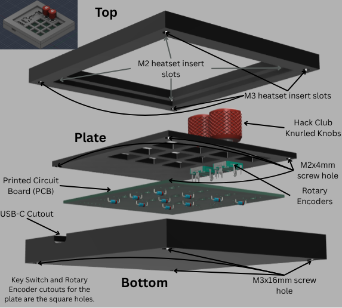
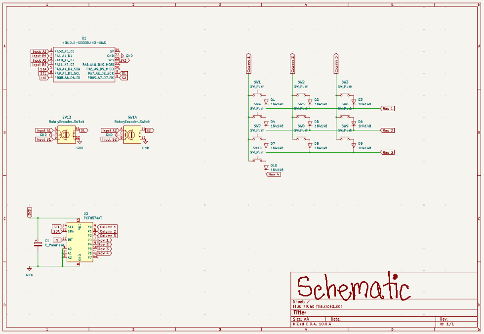

# arnav-hackpad
<b>The arnav-hackpad is a mini-keyboard (or macropad) designed to act as an external number pad with some other cool capabilities, too!</b>

## Inspiration
In my essential technology class at school, two of my favorite modules were coding and 3D printing. When I joined the [Stardance summer program](https://stardance.hackclub.com/) and started looking at the recommended projects, I saw <b>hackpad</b>, and saw it as a great way to combine my love for those two subjects.
## Features
- 2 EC11 Rotary Encoders with Switches
- 10 MX-Style Key Switches
- 3-Part Case
## CAD Model
\
This is my assembled macropad. Click on it to interact with the assembled macropad in Autodesk Fusion's web version.

There are 3 parts to the case: the top, the bottom, and the plate. The arnav-hackpad is top-mounted, meaning that the plate is attached to the top part. The design gives an ≈0.3mm printing tolerance. I added a cool design with my name on the plate, which you can see in the plate demo below!

[Click here to interact with the Plate.](https://a360.co/4g3hhWc)\
[Click here to interact with the Top part.](https://a360.co/4vbjJyh)\
[Click here to interact with the  Bottom part.](https://a360.co/4pMDXNC)
## PCB

This is my PCB's schematic. Click on it to interact with the schematic in KiCanvas.

I used a PCF8574AT I/O expander because all of the pins would not fit on the microchip.

This is my PCB board. Click on it to interact with the PCB Board in KiCanvas.

I know it's very messy, but everything works out in the end!
## Firmware Overview
The macropad is coded using KMK firmware.
- The rotary encoder on the left changes volume, and its switch works as the mute key.
- The rotary encoder on the right changes brightness, and its switch works as the print screen key.
- The key switches are arranged in the same way as the numbers are in a number pad.

## How to make it
### Bill of Materials
To make this macropad, you will need the following:
- 10x Cherry MX Switches
- 10x 1N4148 DO-35 Diodes
- 10x DSA Keycaps
- 2x EC11 Rotary Encoder
- 2x Hack Club Knurled Knob (Replaceable with another knob for EC11 Rotary Encoder)
- 1x XIAO RP2040
- 1x PCF8574AT
- 1x 0805 SMD Capacitor
- 4x M3 x D5mm x L4mm Heatset Inserts
- 4x M2 x D4mm x L3mm Heatset Inserts
- 4x M3 x 16mm screws
- 4x M2 x 4mm screws
- 1x Case (3 printed parts)
- 1x USB-C cable
- 1x Soldering Iron
### PCB
Use the [Gerbers.zip file](Production/Gerbers.zip) to print the PCB from whatever company you want. Make sure you choose the <b>2-layer</b> PCB option. When you solder the components together, make sure to refer to the [online PCB image](https://kicanvas.org/?repo=https%3A%2F%2Fgithub.com%2Farnavshah100%2Farnav-hackpad%2Fblob%2Fmain%2FPCB%2FKiCad%2520file.kicad_pcb) often.
### 3D Printing
Use the [Plate.step file](Production/CAD%20files/Plate.step), [Top.step file](Production/CAD%20files/Top.step), [Bottom.step file](Production/CAD%20files/plate.step), and [Hack Club Knurled Knob.step file in case you are using it](Production/CAD%20files/Hack%20Club%20Knurled%20Knob.step). If you are printing it yourself, I suggest using google to figure out how to print on your specific 3D printer. Otherwise, just give the files above to whoever is printing it. Make sure you use either PLA, ABS, PETG, or Nylon, because certain plastics don't work with heatset inserts.
### Assembly
<b>If you do not know how to do any part of this tutorial, Google can teach you how to!</b>

Finally, it's time to do the assembly! Put the M3 x D5mm x L4mm heatset inserts on the outer holes of the top part, and put the M2 x D4mm x L3mm heatset inserts on the inner holes of the top part. You can use [this image](Assets/ScrewImage.png) to help you.

Next, put the key switches and rotary encoders into the plate. <b>MAKE SURE THE PINS ARE ALIGNED CORRECTLY WITH THE PCB!</b> Put the keycaps on the key switches.

Next, install the firmware onto the microchip. [This is a great guide to help you for this step.](https://wiki.seeedstudio.com/XIAO-RP2040-with-CircuitPython/)

Afterward, <b><i><u>carefully</u></i></b> solder the keyswitches onto the PCB.

For the last step, use the M2x4mm screws to screw the plate onto the top part's M2 heatset insert. The top part of the screw should be touching the plate. I recommend plugging in the PCB into your device and trying using the macropad to check that it works. If your device dpesn't register any of the keypresses, reread all the steps in [the guide](https://github.com/arnavshah100/arnav-hackpad/#how-to-make-it). Use the M3x16mm screws to screw the bottom part onto the top part's M3 heatset insert. The top part of the screw should be touching the bottom part. The labeled image showing where the screws should be is [here](Assets/Assembly.png).

Now, put the knob on the rotary encoder, and you're DONE! <b><u>CELEBRATE!</b></u>

## Credits
- Huge thanks to [@ashah80](https://github.com/ashah80) (my brother!), who helped me in every step of the way, even though he has never made anything hardware-related.
- I was motivated by the [Stardance summer program](https://stardance.hackclub.com/), which both inspired and incentivized me to make this project. I had never even considered making hardware (except small 3D printed toys at school) before Stardance provided me with a great platform to do so.
- The people in the [hackpad slack page](https://hackclub.enterprise.slack.com/archives/C07LESGH0B0) from Hack Club helped answer all my questions.
### Resources I used
- I used [Hack Club's KiCad care package](https://github.com/hackclub/hackpad/releases/tag/v0.1-bugfix) for some of my symbols and footprints in my PCB.
- I used [KiCad's rotary encoder footprint](https://kicad.github.io/footprints/Rotary_Encoder) for my, well, rotary encoder!
- I used [Hack Club's rotary encoder and knurled knob CAD file](https://github.com/hackclub/hackpad/tree/clean/extras/CAD%20models) in my [assembled hackpad file](CAD/arnav-hackpad.step).
- I used some of the [KMK's CircuitPython libraries](https://github.com/KMKfw/kmk_firmware), a key part of my code.

<b>Thank you for <i>reading me</i>!</b>

